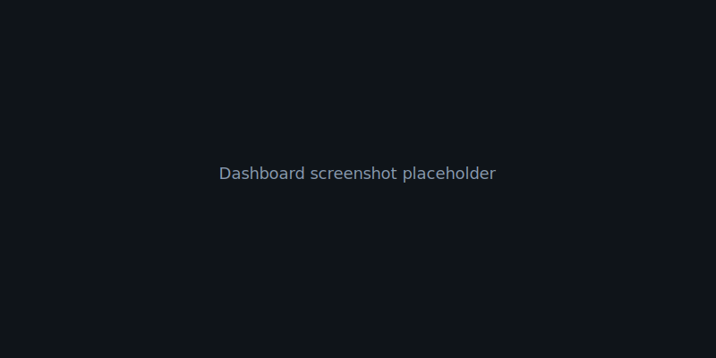

# CallIQ — AI Call Intelligence Platform

AI-powered call intelligence for kitchen cabinet sales: ingest recordings, transcribe with Whisper, analyze with OpenAI (same API key), and review coaching insights in a live dashboard.



## Tech stack


## Prerequisites

- Node.js 18+
- npm 9+
- OpenAI API key (Whisper transcription + structured analysis via Chat Completions)

## Quick start

1. **Clone / open** this repo and `cd` into the project root.
2. **Install:** `npm run install:all` (npm workspaces install client + server).
3. **Environment:** copy `.env.example` to **`.env` in the project root** (next to `package.json`). The API loads that file even though the server runs from `server/`. Set `OPENAI_API_KEY`. Optionally set `OPENAI_ANALYSIS_MODEL` (default `gpt-4o-mini`). Copy `client/.env.example` to `client/.env` if you need a non-default API URL.
4. **Sample audio:** copy the six recordings into `server/uploads/` using the exact filenames referenced in the seed data (`Call-1.mp3`, `Call-2.wav`, `Call 3.wav`, `Call 4.wav`, `Call 5.wav`, `Call 6.wav`). Without these files, the waveform player shows a graceful “Audio file not available” state.
5. **Run:** `npm run dev` — API on port **3001**, Vite on **5173**.
6. **Sign in:** default credentials are **`admin` / `password123`**. Override with `AUTH_USERNAME` and `AUTH_PASSWORD` in `.env`. Auth uses a **signed, stateless** HTTP-only cookie so the same login works across **multiple API processes** (e.g. PM2 cluster) and survives API restarts until expiry. Set **`AUTH_SECRET`** to a long random string in production. Client calls use `credentials: 'include'`; CORS allows your Vite origin (`CLIENT_URL`).

### Conversation quality (call detail)

Each call includes **pacing**, **structure**, and **engagement** scores (1–10) plus a one-line manager summary, aligned with the hackathon “analyze conversation quality” objective. New uploads get this from the analysis model; older JSON without the block is **estimated** in the UI from existing scores and coverage.

### Interactive questionnaire (call detail)

On a call’s analysis page, **Interactive questionnaire** lists the playbook questions as quick chips and a free-form box. Each ask calls **`POST /api/ask`** with the call id and question; the server sends the **stored transcript** to OpenAI and returns an answer grounded in that text only.

## Architecture

```
┌─────────────┐     REST /audio      ┌──────────────┐
│ React (Vite)│ ◄──────────────────► │ Express API  │
│  Dashboard  │                      │  + JSON data │
└─────────────┘                    └──────┬───────┘
                                           │
                                    Whisper + OpenAI
```

| Endpoint | Method | Purpose |
|----------|--------|---------|
| `/api/health` | GET | Health check |
| `/api/calls` | GET | List analyzed calls |
| `/api/calls/:id` | GET | Single call |
| `/api/upload` | POST | Multipart audio upload |
| `/api/transcribe` | POST | Whisper transcription |
| `/api/analyze` | POST | OpenAI JSON analysis + persist |
| `/api/auth/login` | POST | `{ username, password }` → sets session cookie |
| `/api/auth/logout` | POST | Clears session |
| `/api/auth/me` | GET | `{ user }` if session valid |
| `/api/question-library` | GET | Playbook questions (Q1–Q15) |
| `/api/ask` | POST | `{ callId, question }` → transcript-grounded answer |
| `/api/ask-playbook` | POST | `{ callId }` → all Q1–Q15 answers in one model call |

## Seed data

Six pre-built scenarios are copied from `server/seed/` into `server/data/` on first run (when `server/data/` has no JSON):

| ID | Scenario | Sentiment (approx.) |
|----|-----------|---------------------|
| call-1 | New customer discovery — Shaker, farmhouse | positive |
| call-2 | Agent-dominated pitch | neutral |
| call-3 | Returning customer — proposal / pricing | neutral |
| call-4 | Competitor objection handling | positive |
| call-5 | Delivery delay complaint | negative |
| call-6 | Rental property — budget focus | positive |

Dashboard aggregates (from seeds): average score ~**6.7**, sentiment mix **3 / 2 / 1**, average questionnaire coverage ~**42%**, **18** action items total.

## Hackathon

Built with a fast iteration (“vibe coding”) workflow: strong defaults, seeded data, and a single `npm run dev` path for demos.

## Scripts

| Script | Description |
|--------|-------------|
| `npm run dev` | Concurrent API + Vite |
| `npm run dev:server` | API only |
| `npm run dev:client` | Client only |
| `npm run build` | Production build of the client |
| `npm run install:all` | `npm install` (workspaces) |

Optional: regenerate seeds from `server/scripts/build-seeds.cjs` if you change the questionnaire matrix (run from repo: `node server/scripts/build-seeds.cjs`).
# cp-hackethon1
